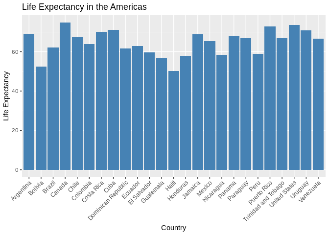
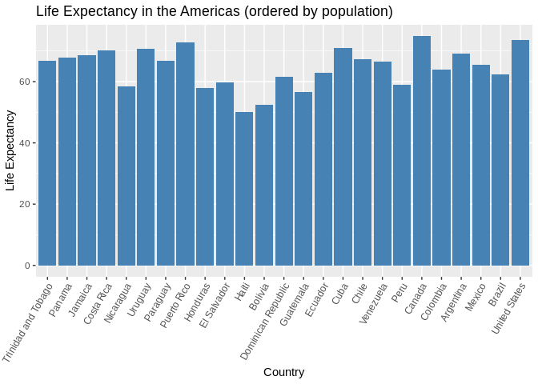
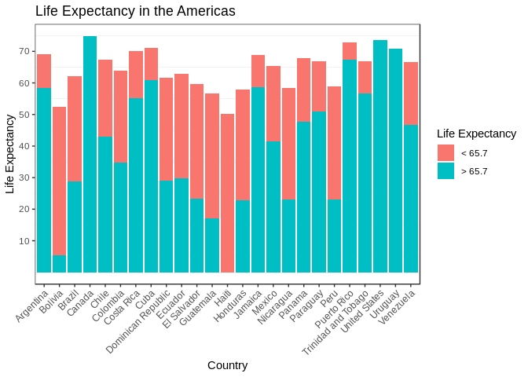

hmw05 - yavyx
================
Javier Castillo-Arnemann
October 19, 2018

First we start by loading the necessary packages.

``` r
suppressPackageStartupMessages(library(tidyverse))
suppressPackageStartupMessages(library(plotly))
library(gapminder)
library(knitr)
```

Part 1: Factor Management
-------------------------

We will first check the structure of the `gapminder` dataset to check that we have factors in it.

``` r
str(gapminder)
```

    ## Classes 'tbl_df', 'tbl' and 'data.frame':    1704 obs. of  6 variables:
    ##  $ country  : Factor w/ 142 levels "Afghanistan",..: 1 1 1 1 1 1 1 1 1 1 ...
    ##  $ continent: Factor w/ 5 levels "Africa","Americas",..: 3 3 3 3 3 3 3 3 3 3 ...
    ##  $ year     : int  1952 1957 1962 1967 1972 1977 1982 1987 1992 1997 ...
    ##  $ lifeExp  : num  28.8 30.3 32 34 36.1 ...
    ##  $ pop      : int  8425333 9240934 10267083 11537966 13079460 14880372 12881816 13867957 16317921 22227415 ...
    ##  $ gdpPercap: num  779 821 853 836 740 ...

As we can see, there are 2 factors: `country` with 142 levels, and `continent` with 5 levels.

We will now filter Oceania out of the dataset and see if the levels change.

``` r
gapm_wo_oceania <- gapminder %>%
  filter(continent != "Oceania")
str(gapm_wo_oceania)
```

    ## Classes 'tbl_df', 'tbl' and 'data.frame':    1680 obs. of  6 variables:
    ##  $ country  : Factor w/ 142 levels "Afghanistan",..: 1 1 1 1 1 1 1 1 1 1 ...
    ##  $ continent: Factor w/ 5 levels "Africa","Americas",..: 3 3 3 3 3 3 3 3 3 3 ...
    ##  $ year     : int  1952 1957 1962 1967 1972 1977 1982 1987 1992 1997 ...
    ##  $ lifeExp  : num  28.8 30.3 32 34 36.1 ...
    ##  $ pop      : int  8425333 9240934 10267083 11537966 13079460 14880372 12881816 13867957 16317921 22227415 ...
    ##  $ gdpPercap: num  779 821 853 836 740 ...

Even though Oceania' countries are not in the new dataset, it still retains the levels. We can drop these levels with base R, or the `forcats` package.

``` r
gapm_wo_oceania %>%
  droplevels() %>%
  str()
```

    ## Classes 'tbl_df', 'tbl' and 'data.frame':    1680 obs. of  6 variables:
    ##  $ country  : Factor w/ 140 levels "Afghanistan",..: 1 1 1 1 1 1 1 1 1 1 ...
    ##  $ continent: Factor w/ 4 levels "Africa","Americas",..: 3 3 3 3 3 3 3 3 3 3 ...
    ##  $ year     : int  1952 1957 1962 1967 1972 1977 1982 1987 1992 1997 ...
    ##  $ lifeExp  : num  28.8 30.3 32 34 36.1 ...
    ##  $ pop      : int  8425333 9240934 10267083 11537966 13079460 14880372 12881816 13867957 16317921 22227415 ...
    ##  $ gdpPercap: num  779 821 853 836 740 ...

``` r
gapm_wo_oceania %>%
  mutate(continent = fct_drop(continent)) %>%
  mutate(country = fct_drop(country)) %>%
  str()
```

    ## Classes 'tbl_df', 'tbl' and 'data.frame':    1680 obs. of  6 variables:
    ##  $ country  : Factor w/ 140 levels "Afghanistan",..: 1 1 1 1 1 1 1 1 1 1 ...
    ##  $ continent: Factor w/ 4 levels "Africa","Americas",..: 3 3 3 3 3 3 3 3 3 3 ...
    ##  $ year     : int  1952 1957 1962 1967 1972 1977 1982 1987 1992 1997 ...
    ##  $ lifeExp  : num  28.8 30.3 32 34 36.1 ...
    ##  $ pop      : int  8425333 9240934 10267083 11537966 13079460 14880372 12881816 13867957 16317921 22227415 ...
    ##  $ gdpPercap: num  779 821 853 836 740 ...

As we can see, we can drop all levels with base R, and with `forcats`, we can drop individual ones. However, the base R function has an `except` argument that lets us specify which factor we don't want to drop.

``` r
gapm_wo_oceania %>%
  droplevels(except = 2) %>%  #Indicate column to keep
  str()
```

    ## Classes 'tbl_df', 'tbl' and 'data.frame':    1680 obs. of  6 variables:
    ##  $ country  : Factor w/ 140 levels "Afghanistan",..: 1 1 1 1 1 1 1 1 1 1 ...
    ##  $ continent: Factor w/ 5 levels "Africa","Americas",..: 3 3 3 3 3 3 3 3 3 3 ...
    ##  $ year     : int  1952 1957 1962 1967 1972 1977 1982 1987 1992 1997 ...
    ##  $ lifeExp  : num  28.8 30.3 32 34 36.1 ...
    ##  $ pop      : int  8425333 9240934 10267083 11537966 13079460 14880372 12881816 13867957 16317921 22227415 ...
    ##  $ gdpPercap: num  779 821 853 836 740 ...

Here we see that only the empty `country` factors were dropped, beacuse the second factor (continent) was specified in the `except` parameter.

We can also reorder the factor other than alfabetically (which is the default). We'll work with American countries for this.

When we plot some information about the countries, they are ordered alphabetically.

``` r
gap_america <- gapminder%>%
  filter(continent == "Americas") %>%
  droplevels()

ggplot(gap_america) +
    geom_bar(aes(country, lifeExp/n_distinct(gapminder$year)), stat = "identity", fill = "steel blue") + #tell geom_bar to use the y aesthetic instead of the bar. Divide by 12 to get correct lifeExp values
    theme(axis.text.x = element_text(angle = 45, hjust = 1)) + #change x label angles to be more readable
    labs(title = "Life Expectancy in the Americas",
         x = "Country", y = "Life Expectancy")
```



We can change this by reordering the countries factor by the population in each country, for example

``` r
gap_america %>%
  mutate(country = fct_reorder(country, pop)) %>% #Reorder factor
  ggplot() +
    geom_bar(aes(country, lifeExp/n_distinct(gapminder$year)), stat = "identity", fill = "steel blue") + #tell geom_bar to use the y aesthetic instead of the bar. Divide by 12 to get correct lifeExp values
    theme(axis.text.x = element_text(angle = 60, hjust = 1)) + #change x label angles to be more readable
    labs(title = "Life Expectancy in the Americas (ordered by population)",
         x = "Country", y = "Life Expectancy")
```



We can see that in general, there is not a strong relationship between population and life expectancies in the Americas.

Let's see if by using `arrange()` we get similar results.

``` r
gap_america_arr <- gap_america %>%
  droplevels() %>%
  group_by(country) %>%
  mutate(mean_pop = mean(pop)) %>%
  arrange(mean_pop) #Arrange by mean poplutation some all country measurements stay

kable(head(gap_america_arr, 15))
```

| country             | continent |  year|  lifeExp|      pop|  gdpPercap|  mean\_pop|
|:--------------------|:----------|-----:|--------:|--------:|----------:|----------:|
| Trinidad and Tobago | Americas  |  1952|   59.100|   662850|   3023.272|    1006470|
| Trinidad and Tobago | Americas  |  1957|   61.800|   764900|   4100.393|    1006470|
| Trinidad and Tobago | Americas  |  1962|   64.900|   887498|   4997.524|    1006470|
| Trinidad and Tobago | Americas  |  1967|   65.400|   960155|   5621.368|    1006470|
| Trinidad and Tobago | Americas  |  1972|   65.900|   975199|   6619.551|    1006470|
| Trinidad and Tobago | Americas  |  1977|   68.300|  1039009|   7899.554|    1006470|
| Trinidad and Tobago | Americas  |  1982|   68.832|  1116479|   9119.529|    1006470|
| Trinidad and Tobago | Americas  |  1987|   69.582|  1191336|   7388.598|    1006470|
| Trinidad and Tobago | Americas  |  1992|   69.862|  1183669|   7370.991|    1006470|
| Trinidad and Tobago | Americas  |  1997|   69.465|  1138101|   8792.573|    1006470|
| Trinidad and Tobago | Americas  |  2002|   68.976|  1101832|  11460.600|    1006470|
| Trinidad and Tobago | Americas  |  2007|   69.819|  1056608|  18008.509|    1006470|
| Panama              | Americas  |  1952|   55.191|   940080|   2480.380|    1985290|
| Panama              | Americas  |  1957|   59.201|  1063506|   2961.801|    1985290|
| Panama              | Americas  |  1962|   61.817|  1215725|   3536.540|    1985290|

``` r
levels(gap_america_arr$country)
```

    ##  [1] "Argentina"           "Bolivia"             "Brazil"             
    ##  [4] "Canada"              "Chile"               "Colombia"           
    ##  [7] "Costa Rica"          "Cuba"                "Dominican Republic" 
    ## [10] "Ecuador"             "El Salvador"         "Guatemala"          
    ## [13] "Haiti"               "Honduras"            "Jamaica"            
    ## [16] "Mexico"              "Nicaragua"           "Panama"             
    ## [19] "Paraguay"            "Peru"                "Puerto Rico"        
    ## [22] "Trinidad and Tobago" "United States"       "Uruguay"            
    ## [25] "Venezuela"

Here we see that the dataset is arranged by population too, but with the `levels` function we can see that the factor is still ordered alfabetically, so when we plot it we will see the same.

``` r
ggplot(gap_america_arr) +
    geom_bar(aes(country, lifeExp/n_distinct(gapminder$year)), stat = "identity", fill = "steel blue") + #tell geom_bar to use the y aesthetic instead of the bar. Divide by 12 to get correct lifeExp values
    theme(axis.text.x = element_text(angle = 45, hjust = 1)) + #change x label angles to be more readable
    labs(title = "Life Expectancy in the Americas",
         x = "Country", y = "Life Expectancy")
```


Looking in the [R documentation](https://www.rdocumentation.org/packages/dplyr/versions/0.7.6/topics/arrange), we can see that `arrange()` only reorders the rows of a dataframe, so it will never change the factor levels order which is what we are looking for.

Part 2: File I/O
----------------

We'll do some experimenting with reading in data, modifying it, and seeing if the changes remain after saving it to a new file and reading it in again.

First, let's filter the gapminder dataset to only have information from 2007 and save that in a csv file, and read it back in to see if it keeps the factors' order.

``` r
gapminder_2007 <- gapminder %>%
  filter(year == 2007)
str(gapminder_2007)
```

    ## Classes 'tbl_df', 'tbl' and 'data.frame':    142 obs. of  6 variables:
    ##  $ country  : Factor w/ 142 levels "Afghanistan",..: 1 2 3 4 5 6 7 8 9 10 ...
    ##  $ continent: Factor w/ 5 levels "Africa","Americas",..: 3 4 1 1 2 5 4 3 3 4 ...
    ##  $ year     : int  2007 2007 2007 2007 2007 2007 2007 2007 2007 2007 ...
    ##  $ lifeExp  : num  43.8 76.4 72.3 42.7 75.3 ...
    ##  $ pop      : int  31889923 3600523 33333216 12420476 40301927 20434176 8199783 708573 150448339 10392226 ...
    ##  $ gdpPercap: num  975 5937 6223 4797 12779 ...

``` r
write_csv(gapminder_2007, "gapminder2007.csv") 

gapminder_2007_2 <- read_csv("gapminder2007.csv")
```

    ## Parsed with column specification:
    ## cols(
    ##   country = col_character(),
    ##   continent = col_character(),
    ##   year = col_integer(),
    ##   lifeExp = col_double(),
    ##   pop = col_integer(),
    ##   gdpPercap = col_double()
    ## )

``` r
str(gapminder_2007_2)
```

    ## Classes 'tbl_df', 'tbl' and 'data.frame':    142 obs. of  6 variables:
    ##  $ country  : chr  "Afghanistan" "Albania" "Algeria" "Angola" ...
    ##  $ continent: chr  "Asia" "Europe" "Africa" "Africa" ...
    ##  $ year     : int  2007 2007 2007 2007 2007 2007 2007 2007 2007 2007 ...
    ##  $ lifeExp  : num  43.8 76.4 72.3 42.7 75.3 ...
    ##  $ pop      : int  31889923 3600523 33333216 12420476 40301927 20434176 8199783 708573 150448339 10392226 ...
    ##  $ gdpPercap: num  975 5937 6223 4797 12779 ...
    ##  - attr(*, "spec")=List of 2
    ##   ..$ cols   :List of 6
    ##   .. ..$ country  : list()
    ##   .. .. ..- attr(*, "class")= chr  "collector_character" "collector"
    ##   .. ..$ continent: list()
    ##   .. .. ..- attr(*, "class")= chr  "collector_character" "collector"
    ##   .. ..$ year     : list()
    ##   .. .. ..- attr(*, "class")= chr  "collector_integer" "collector"
    ##   .. ..$ lifeExp  : list()
    ##   .. .. ..- attr(*, "class")= chr  "collector_double" "collector"
    ##   .. ..$ pop      : list()
    ##   .. .. ..- attr(*, "class")= chr  "collector_integer" "collector"
    ##   .. ..$ gdpPercap: list()
    ##   .. .. ..- attr(*, "class")= chr  "collector_double" "collector"
    ##   ..$ default: list()
    ##   .. ..- attr(*, "class")= chr  "collector_guess" "collector"
    ##   ..- attr(*, "class")= chr "col_spec"

We can see that `read_csv()` does not coerce character values into factores, like the base R `read.csv` function does. Therefore, we lose the factors' information and would have to manually convert the variables factors as follows.

``` r
gapminder_2007_2$country <- factor(gapminder_2007_2$country)
gapminder_2007_2$continent<- factor(gapminder_2007_2$continent)

str(gapminder_2007_2)
```

    ## Classes 'tbl_df', 'tbl' and 'data.frame':    142 obs. of  6 variables:
    ##  $ country  : Factor w/ 142 levels "Afghanistan",..: 1 2 3 4 5 6 7 8 9 10 ...
    ##  $ continent: Factor w/ 5 levels "Africa","Americas",..: 3 4 1 1 2 5 4 3 3 4 ...
    ##  $ year     : int  2007 2007 2007 2007 2007 2007 2007 2007 2007 2007 ...
    ##  $ lifeExp  : num  43.8 76.4 72.3 42.7 75.3 ...
    ##  $ pop      : int  31889923 3600523 33333216 12420476 40301927 20434176 8199783 708573 150448339 10392226 ...
    ##  $ gdpPercap: num  975 5937 6223 4797 12779 ...
    ##  - attr(*, "spec")=List of 2
    ##   ..$ cols   :List of 6
    ##   .. ..$ country  : list()
    ##   .. .. ..- attr(*, "class")= chr  "collector_character" "collector"
    ##   .. ..$ continent: list()
    ##   .. .. ..- attr(*, "class")= chr  "collector_character" "collector"
    ##   .. ..$ year     : list()
    ##   .. .. ..- attr(*, "class")= chr  "collector_integer" "collector"
    ##   .. ..$ lifeExp  : list()
    ##   .. .. ..- attr(*, "class")= chr  "collector_double" "collector"
    ##   .. ..$ pop      : list()
    ##   .. .. ..- attr(*, "class")= chr  "collector_integer" "collector"
    ##   .. ..$ gdpPercap: list()
    ##   .. .. ..- attr(*, "class")= chr  "collector_double" "collector"
    ##   ..$ default: list()
    ##   .. ..- attr(*, "class")= chr  "collector_guess" "collector"
    ##   ..- attr(*, "class")= chr "col_spec"

Let's check if we can keep the `arrange()` does survive the writing and reading steps.

``` r
gapminder_2007_arr <- gapminder_2007 %>%
  arrange(continent)

head(gapminder_2007_arr)
```

    ## # A tibble: 6 x 6
    ##   country      continent  year lifeExp      pop gdpPercap
    ##   <fct>        <fct>     <int>   <dbl>    <int>     <dbl>
    ## 1 Algeria      Africa     2007    72.3 33333216     6223.
    ## 2 Angola       Africa     2007    42.7 12420476     4797.
    ## 3 Benin        Africa     2007    56.7  8078314     1441.
    ## 4 Botswana     Africa     2007    50.7  1639131    12570.
    ## 5 Burkina Faso Africa     2007    52.3 14326203     1217.
    ## 6 Burundi      Africa     2007    49.6  8390505      430.

``` r
write_csv(gapminder_2007_arr, "gapminder2007_arr.csv")

gapminder_2007_arr_2 <- read_csv("gapminder2007_arr.csv")
```

    ## Parsed with column specification:
    ## cols(
    ##   country = col_character(),
    ##   continent = col_character(),
    ##   year = col_integer(),
    ##   lifeExp = col_double(),
    ##   pop = col_integer(),
    ##   gdpPercap = col_double()
    ## )

``` r
head(gapminder_2007_arr_2)
```

    ## # A tibble: 6 x 6
    ##   country      continent  year lifeExp      pop gdpPercap
    ##   <chr>        <chr>     <int>   <dbl>    <int>     <dbl>
    ## 1 Algeria      Africa     2007    72.3 33333216     6223.
    ## 2 Angola       Africa     2007    42.7 12420476     4797.
    ## 3 Benin        Africa     2007    56.7  8078314     1441.
    ## 4 Botswana     Africa     2007    50.7  1639131    12570.
    ## 5 Burkina Faso Africa     2007    52.3 14326203     1217.
    ## 6 Burundi      Africa     2007    49.6  8390505      430.

This change does survive the writing/reading steps.

Finally, we can check if after reordering a factor we would get the same ordering with `read.csv()` that does coerce character vectors into factors.

``` r
gapminder_2007 <- gapminder_2007 %>%
  mutate(country = fct_reorder(country, pop))

str(gapminder_2007)
```

    ## Classes 'tbl_df', 'tbl' and 'data.frame':    142 obs. of  6 variables:
    ##  $ country  : Factor w/ 142 levels "Sao Tome and Principe",..: 107 27 108 79 114 94 57 6 136 71 ...
    ##  $ continent: Factor w/ 5 levels "Africa","Americas",..: 3 4 1 1 2 5 4 3 3 4 ...
    ##  $ year     : int  2007 2007 2007 2007 2007 2007 2007 2007 2007 2007 ...
    ##  $ lifeExp  : num  43.8 76.4 72.3 42.7 75.3 ...
    ##  $ pop      : int  31889923 3600523 33333216 12420476 40301927 20434176 8199783 708573 150448339 10392226 ...
    ##  $ gdpPercap: num  975 5937 6223 4797 12779 ...

``` r
write_csv(gapminder_2007, "gapminder2007_factors.csv") 

gapminder_2007_2 <- read.csv("gapminder2007_factors.csv")

str(gapminder_2007_2)
```

    ## 'data.frame':    142 obs. of  6 variables:
    ##  $ country  : Factor w/ 142 levels "Afghanistan",..: 1 2 3 4 5 6 7 8 9 10 ...
    ##  $ continent: Factor w/ 5 levels "Africa","Americas",..: 3 4 1 1 2 5 4 3 3 4 ...
    ##  $ year     : int  2007 2007 2007 2007 2007 2007 2007 2007 2007 2007 ...
    ##  $ lifeExp  : num  43.8 76.4 72.3 42.7 75.3 ...
    ##  $ pop      : int  31889923 3600523 33333216 12420476 40301927 20434176 8199783 708573 150448339 10392226 ...
    ##  $ gdpPercap: num  975 5937 6223 4797 12779 ...

Our new dataset does have the factors as we predicted, but the order was not kept. This is probably because `.csv` files don't keep the factor information, the are just plain text files and there is no way that R can recover this information. R assigns the factors after reading in the data.

Part 3: Visualization design
----------------------------

We'll modify one of the life expectancy figures from part 1.

First attempt:

``` r
ggplot(gap_america) +
    geom_bar(aes(country, lifeExp/n_distinct(gapminder$year)), stat = "identity", fill = "steel blue") + #tell geom_bar to use the y aesthetic instead of the bar. Divide by 12 to get correct lifeExp values
    theme(axis.text.x = element_text(angle = 45, hjust = 1)) + #change x label angles to be more readable
    labs(title = "Life Expectancy in the Americas",
         x = "Country", y = "Life Expectancy")
```


New version:

``` r
final_plot <- ggplot(gap_america) +
    geom_bar(aes(country, lifeExp/n_distinct(gapminder$year), fill = lifeExp > mean(lifeExp)), stat = "identity") + #tell geom_bar to use the y aesthetic instead of the bar. Divide by 12 to get correct lifeExp values. Color bars according to times lifeExp was above the mean
    theme_bw() +
    theme(axis.text.x = element_text(angle = 45, hjust = 1),
          panel.grid.major = element_blank()) + #change x label angles to be more readable
    labs(title = "Life Expectancy in the Americas",
         x = "Country", y = "Life Expectancy") +
    scale_y_continuous(breaks = 1:10 * 10) + #add y labels every 10 years
    scale_fill_discrete(name = "Life Expectancy",
                         breaks = c("FALSE", "TRUE"),
                         labels = c("< 65.7", "> 65.7")) #edit legend values

final_plot
```



Finally, we'll nake a 3D plotly that shows similar information as the previous plot, and save it.

``` r
plot_ly(gap_america, 
        x = ~country, 
        y = ~lifeExp, 
        z = ~year,
        type = "scatter3d",
        mode = "markers",
        opacity = 0.8,
        color = ~ lifeExp > mean(lifeExp)) %>%
  htmlwidgets::saveWidget("plotly.html")
```

    ## Warning in RColorBrewer::brewer.pal(N, "Set2"): minimal value for n is 3, returning requested palette with 3 different levels

    ## Warning in RColorBrewer::brewer.pal(N, "Set2"): minimal value for n is 3, returning requested palette with 3 different levels

Part 4: Writing figures to file
-------------------------------

We will save the last bar plot to a file using `ggsave`.

``` r
ggsave("lifeExp_america.png", plot = final_plot, width = 18, height = 8, units = "cm")
```
